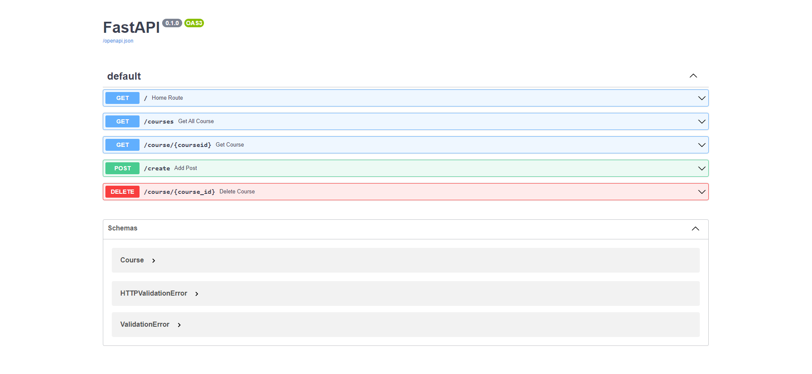

# **This is a Fast API backend for creating, deleting and fetching all the data from a dummy DB**





### **Create a virtual enviroment and activating the enviroment**
```sh
python -m venv myapp
myapp\Scripts\activate
```

### **Running the Fast API app**
```
uvicorn main:app --reload
```

